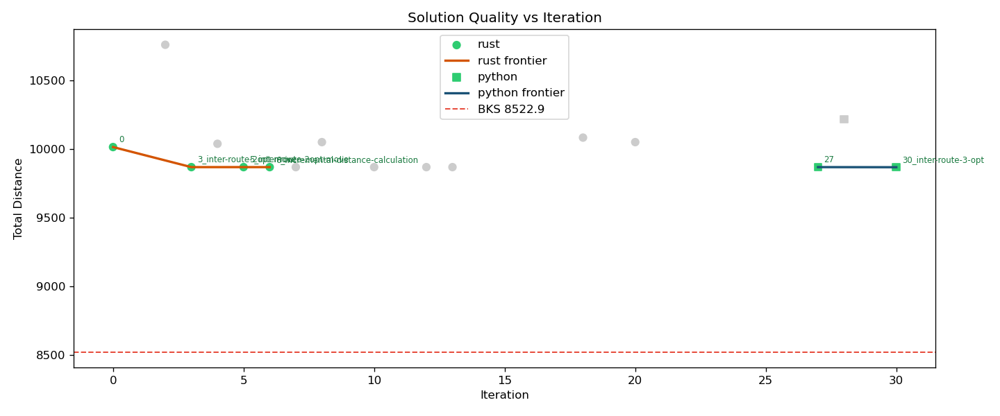
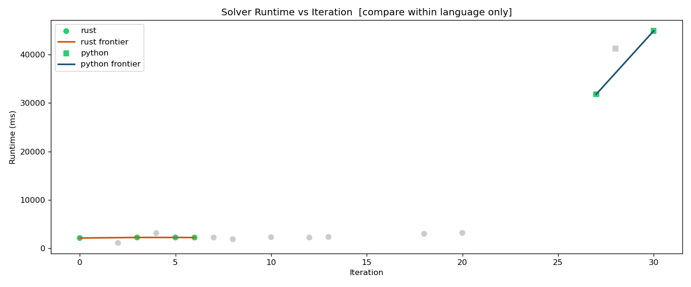
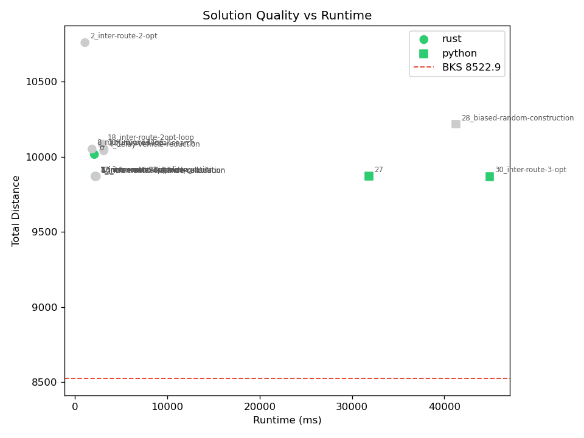

# VRPTW Auto-Research Loop

An autonomous optimisation research loop for the **Vehicle Routing Problem with Time Windows (VRPTW)**.
A planning agent proposes algorithmic improvements; a Qwen2.5-Coder agent implements them in Rust; the orchestrator benchmarks, validates, evaluates, and merges improvements automatically.

## Problem

**Instance:** RC1_4\_1 (Homberger 400-customer benchmark)

| Property | Value |
|---|---|
| Customers | 400 |
| Vehicle capacity | 200 |
| Fleet limit | 100 vehicles |
| Best Known Solution (BKS) distance | **8522.90** |
| BKS reference | CVRPLib / SINTEF (8571.32 with 36 vehicles) |
| Objective | Lexicographic: 1) minimise vehicles, 2) minimise total distance |
| Distance metric | Euclidean, double precision |

RC1 instances combine random customer locations with clustered time windows,
testing both feasibility handling (tight TW constraints) and geometric route quality simultaneously.
This makes them a robust all-around benchmark compared to purely random (R) or clustered (C) instances.

## Architecture

```
orchestrator.py
  ├── DeepSeek-R1:7b  (planner)     — reads research history, proposes one improvement (JSON)
  ├── Qwen2.5-Coder:7b (implementer) — writes Python code, self-repairs up to 3 times
  ├── validate.py      (validator)   — Python feasibility check before accept/reject
  └── Python solver    (evaluator)  — vrptw.py + solver.py, 300s timeout
```

Both models run locally via **Ollama** and are evicted from VRAM/RAM between phases.
The planner outputs structured JSON; the orchestrator parses it without text heuristics.

> **Language history:** iterations 1–26 used a Rust solver (`src/solver.rs`). From iteration 27
> onward the solver is Python (`solver.py`). Runtime comparisons are only meaningful within
> the same language — the research log includes a `language` column for filtering.

### Loop logic

```
for each iteration (max 100, configurable):
  1. Checkout main; read best_result.json as baseline
  2. Create experiment/<N>_<descriptor> branch
  3. Planner reads research_history.md + solver.py → emits JSON plan → experiment_plan.md
  4. Qwen reads experiment_plan.md + solver.py → rewrites solver.py
     └── repair loop: run solver → on error, fix → repeat (max 3 attempts)
  5. Run solver on RC1_4_1 (hard timeout 300s); solver writes solution.txt
  6. Feasibility check: python3 validate.py → reports constraint violations if any
  7. Accept / reject:
     ├── Infeasible              → archive branch, log violations, do not merge
     ├── Quality improved (lex.) → keep
     ├── Faster, same quality    → keep
     └── Neither improved        → archive branch, do not merge
  8. If kept: update best_result.json, regenerate graphs, merge to main
  9. Sleep 10s (cooling)
```

### Accept / reject rule

Quality is lexicographic: fewer vehicles first, then shorter distance. A solution is only kept
if it strictly improves quality. Runtime is tracked for information but does not drive accept/reject.

## Python solver structure

The solver is split into two files (mirroring the previous Rust split):

- **`vrptw.py`** — infrastructure only (read-only, managed by the repo). Defines all data
  structures (`Problem`, `Customer`, `Route`), utility functions (`dist`, `route_distance`,
  `route_feasible`, `best_insertion_in_route`), instance parsing, solution output, and the
  `__main__` entry point.

- **`solver.py`** — all heuristics (AI-managed). Begins with `from vrptw import *`.
  Exposes a single entry point: `def solve(prob: Problem) -> list`.

The AI only edits `solver.py`. Run the solver via `python3 vrptw.py <instance>`.

### Heuristics in `solver.py`

1. **Regret-2 construction** — for each unrouted customer, compute the cost difference
   between its best and second-best feasible insertion. Insert the customer with the
   highest regret (most urgent to place now). Creates an initial feasible solution.

2. **Vehicle reduction** (`try_reduce_vehicles`) — attempt to relocate all customers from the
   smallest route into other routes using a scratch-copy approach that commits each insertion
   immediately. Repeat until no further reduction is possible.

3. **Intra-route 2-opt** — standard segment reversal with TW feasibility check.

4. **Or-opt (1/2/3 segments)** — intra- and inter-route segment relocation.
   Interleaved with vehicle reduction until no improvement.

5. **Inter-route 2-opt** (`apply_inter_route_2opt`) — swap two adjacent customer pairs
   between different routes. Added in iteration 3.

<!-- BEST_RESULT_START -->
### Current best result on RC1_4\_1

| Metric | Value |
|---|---|
| Vehicles | 40 |
| Total distance | 9869.40 |
| Gap to BKS | ~15.8 % |
| Runtime | ~44.9 s (python) |
<!-- BEST_RESULT_END -->

## Running manually

```bash
# Solve RC1_4_1
python3 vrptw.py instances/homberger_400_customer_instances/RC1_4_1.TXT

# vrptw.py writes solution.txt and prints:
# RESULT_VEHICLES: <n>
# RESULT_DISTANCE: <d>
# RESULT_TIME_MS: <t>

# Validate the solution
python3 validate.py instances/homberger_400_customer_instances/RC1_4_1.TXT solution.txt
```

## Running the research loop

```bash
# Install Python dependencies (once)
pip install requests matplotlib

# Configure in orchestrator.py:
#   MAX_ITERATIONS = 100   (0 = unlimited, Ctrl-C to stop)
#   SOLVER_TIMEOUT_S = 600

python3 -u orchestrator.py 2>&1 | tee loop.log
```

The loop is resumable: `get_iteration_count()` scans both `research_log.csv` and
`research_history.md` to find the last completed iteration and continues from there.

## Output files

| File | Description |
|---|---|
| `best_result.json` | Current best solution metadata (vehicles, distance, time, iteration) |
| `research_log.csv` | All iterations: vehicles, distance, runtime, gap%, improvement flag |
| `research_history.md` | Append-only log of all plans and outcomes (read by the planner each iteration) |
| `experiment_plan.md` | Per-iteration plan written by the planner, read by Qwen (overwritten each iteration) |
| `solution.txt` | Full route detail from the most recent solver run |
| `graphs/distance_vs_iteration.png` | Solution quality evolution (rust ● / python ■ markers) |
| `graphs/runtime_vs_iteration.png` | Solver runtime evolution (compare within language only) |
| `graphs/quality_vs_runtime.png` | Quality vs runtime scatter (Pareto view) |

<!-- GRAPHS_START -->
## Progress Graphs






<!-- GRAPHS_END -->

## Instance data

Homberger 400-customer instances are stored in `instances/homberger_400_customer_instances/`.
Format follows the Solomon convention: depot at index 0, columns are
`CUST_NO X Y DEMAND READY_TIME DUE_DATE SERVICE_TIME`.
Travel time equals Euclidean distance (no separate speed parameter).

## Repository structure

```
.
├── vrptw.py                             # Infrastructure: types, parsing, I/O (read-only)
├── solver.py                            # Heuristics: all AI-editable code
├── src/
│   ├── main.rs                          # Legacy Rust infrastructure (iterations 1–26)
│   └── solver.rs                        # Legacy Rust heuristics (iterations 1–26)
├── orchestrator.py                      # Python automation loop
├── validate.py                          # Python feasibility validator
├── prompts/
│   ├── sys_planner.md                   # System prompt for DeepSeek-R1 (planner, JSON output)
│   ├── sys_coder.md                     # System prompt for Qwen (implementer)
│   └── sys_repair.md                    # System prompt for Qwen repair loop
├── instances/
│   └── homberger_400_customer_instances/
│       └── RC1_4_1.TXT                  # Benchmark instance
├── graphs/                              # Auto-generated PNG graphs
├── best_result.json                     # Current best solution (auto-updated)
├── research_log.csv                     # Iteration log with language column (auto-updated)
├── research_history.md                  # Research notes (append-only)
├── experiment_plan.md                   # Current iteration plan
└── solution.txt                         # Most recent solver output
```
